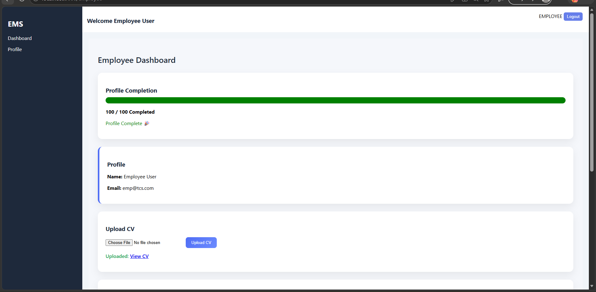
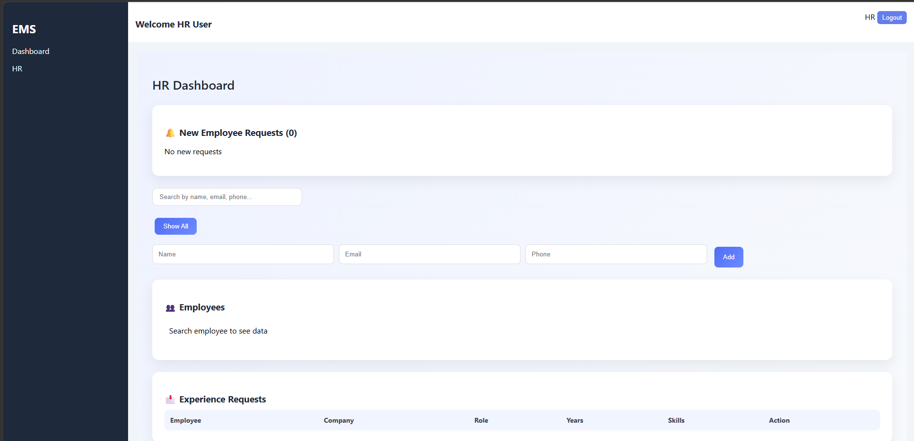
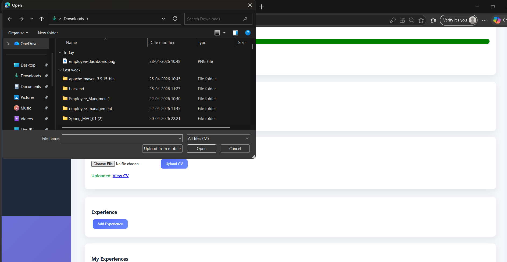

#  Employee Management System (EMS)

---

##  Project Overview

Employee Management System is a full-stack web application that allows companies to manage employees, their profiles, CVs, and experience verification workflow.

---

##  Features

### 👨‍💼 Employee Module

* Upload CV 📄
* Add multiple experiences
* Profile completion score (0–100)
* View approval status

### 🧑‍💼 HR Module

* Approve new employees
* View pending requests
* Approve experience
* Search employees
* Dashboard stats 
* Notification system 

---

## 🛠 Tech Stack

### Frontend

* React.js
* CSS

### Backend

* Spring Boot
* REST APIs

### Database

* MySQL

---

##  System Flow

1. Employee registers → status = PENDING
2. HR approves employee
3. Employee uploads CV + adds experience
4. HR verifies experience
5. Status updates visible to employee

---

##  Database Design

* User Table
* Experience Table

---

##  API Endpoints (Sample)

* POST `/company/user/{companyId}` → Create employee
* GET `/company/users/{companyId}` → Get employees
* PUT `/company/approve/{id}` → Approve employee
* POST `/experience/add/{userId}` → Add experience
* PUT `/experience/hr-approve/{id}` → Approve experience

---

##  Setup Instructions

### Frontend

```bash
npm install
npm start
```

### Backend

```bash
mvn spring-boot:run
```

---

## 📁 Folder Structure

### Frontend

* src/
* components/
* pages/

### Backend

* controller/
* entity/
* repository/
* service/
* serivceImplemntion

---

##  Future Scope

* Role-based authentication
* Email notifications
* File storage on cloud
* Analytics dashboard

## 📸 Screenshots

### 👨‍💼 Employee Dashboard


### 🧑‍💼 HR Dashboard


### 📄 CV Upload

##  Author

Prajwal Saste
